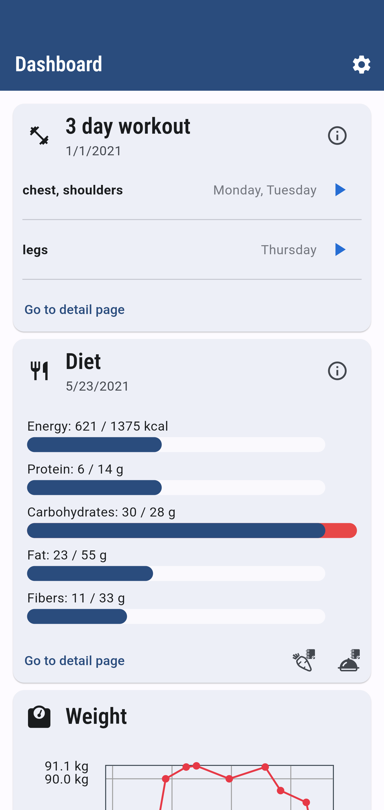
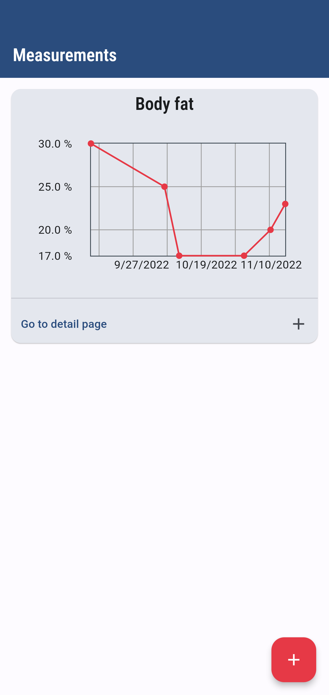
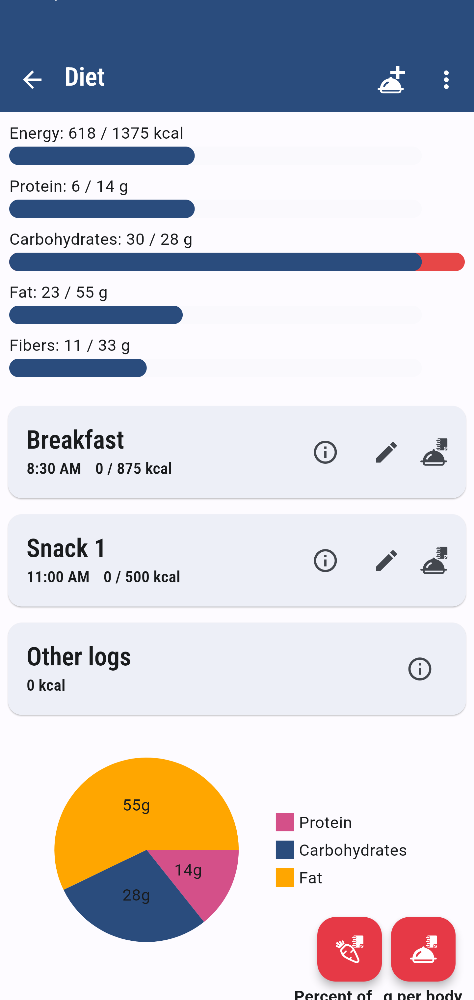

# WGER ​​WORKOUT MANAGER
👨‍🏫ESTE É UM APLICATIVO FLUTTER GRATUITO E DE CÓDIGO ABERTO QUE GERENCIA E RASTREIA/REGISTRA SEUS EXERCÍCIOS E TREINOS PESSOAIS, PESO E PLANOS DE DIETA.

<p>



</p>

## DESCRIÇÃO:
O wger é um aplicativo Flutter gratuito e de código aberto projetado para gerenciar e registrar seus exercícios e treinos pessoais, monitorar seu peso e organizar seus planos de dieta. Este aplicativo móvel, desenvolvido com Flutter, se comunica via REST com o servidor principal, garantindo uma integração eficiente e atualizações em tempo real.

## EXECUTANDO O PROJETO:
### 1. VERIFICAR DEPENDÊNCIAS:
Dentro do diretório `./CODIGO`, execute o seguinte comando no terminal para garantir que todas as dependências do projeto sejam instaladas:

```
flutter pub get
```

Isso garantirá que todos os pacotes listados no arquivo `pubspec.yaml` sejam baixados e instalados corretamente.

### 2. INSTALE O [SERVIDOR WGER​](HTTPS://GITHUB.COM/WGER-PROJECT/WGER): 
A maneira mais fácil é iniciar o desenvolvimento docker-compose: < https://github.com/wger-project/docker >

Alternativamente, você pode usar o servidor de teste (o banco de dados é redefinido todos os dias):

* URL: `https://wger-master.rge.uber.space`
* nome de usuário: `usuário`
* senha: `flutteruser`
* Chave de API: `31e2ea0322c07b9df583a9b6d1e794f7139e78d4`

O aplicativo reclamará sobre uma chave de API não definida. Você pode simplesmente ignore isso durante o desenvolvimento, isso só é importante se você quiser registrar diretamente pelo aplicativo. Se você deseja apenas fazer login, pode pular esta seção.

Se você quiser se registrar diretamente pelo aplicativo, você precisa definir um usuário no backend que é permitido fazer isso. Para isso, crie/cadastre um novo usuário, gere uma chave API e execute `` python3 manager.py add-user-rest theusername `` (mais tarde você pode listar todos os
usuários registrados com `` python3 manage.py list-users-api `` ).

Em seguida, crie um novo arquivo ``wger.properties`` em ``fastlane/metadata/envfiles/`` e adicione a chave:

```propriedades
Chave_API_WGER = 123456
```

Alternativamente, adicione a chave como uma variável de ambiente, por exemplo,executando o comando ` source` comando no arquivo.

### 3. EXECUTAR O APLICATIVO NO EMULADOR OU DISPOSITIVO FÍSICO:
Para executar o aplicativo Flutter no seu emulador ou dispositivo físico, use o comando:

```
flutter run
```

Este comando irá compilar o aplicativo e instalá-lo no dispositivo ou emulador conectado. Certifique-se de que o dispositivo esteja conectado via USB e com a depuração USB ativada, se estiver usando um dispositivo físico Android.

## GERANDO O APLICATIVO:

- **Para Android:**

  Primeiro, certifique-se de que o aplicativo esteja funcionando corretamente usando `flutter run`.

  Em seguida, para gerar o APK, você pode usar o comando:

  ```
  flutter build apk
  ```

  Isso compilará o projeto Flutter em um arquivo APK, que pode ser encontrado na pasta `build\app\outputs\flutter-apk`.

- **Para IOS:**

   Para gerar um aplicativo Flutter para iOS, você precisa de um ambiente de desenvolvimento configurado corretamente no macOS, pois o desenvolvimento iOS é suportado apenas nesse sistema operacional. Aqui estão os passos básicos para gerar um aplicativo Flutter para iOS:

   1. **MacOS:** Certifique-se de estar usando um computador com macOS.
      
   2. **Xcode:** Instale o Xcode na sua máquina a partir da Mac App Store. O Xcode inclui ferramentas essenciais de desenvolvimento para iOS, como simuladores e o compilador Swift.

   3. **Flutter SDK:** Tenha o Flutter instalado e configurado corretamente no seu ambiente. Você pode baixar o Flutter no site oficial e seguir as instruções de instalação para macOS.

   4. **Cocoapods:** Instale o Cocoapods, que é um gerenciador de dependências para projetos iOS. Você pode instalá-lo usando o Terminal com o comando:

      ```bash
      sudo gem install cocoapods
      ```

   5. **Gerar o Pacote do Aplicativo (IPA):**

      Para gerar um arquivo IPA do seu aplicativo Flutter para distribuição ou teste em dispositivos iOS, siga estes passos:

      - Abra o projeto no Visual Studio Code.
      - No terminal, execute o seguinte comando:

      ```bash
      flutter build ios --release
      ```

      Esse comando compilará o aplicativo Flutter para iOS em modo release.

      - Após a conclusão do processo de compilação, você encontrará o arquivo IPA gerado no diretório `build/ios/archive`.

## NÃO SABE?
- Entendemos que para manipular arquivos em muitas linguagens e tecnologias relacionadas, é necessário possuir conhecimento nessas áreas. Para auxiliar nesse aprendizado, oferecemos cursos gratuitos disponíveis:
* [CURSO DE DART](https://github.com/VILHALVA/CURSO-DE-DART)
* [CURSO DE FLUTTER](https://github.com/VILHALVA/CURSO-DE-FLUTTER)
* [CURSO DE RUBY](https://github.com/VILHALVA/CURSO-DE-RUBY)
* [CURSO DE C++](https://github.com/VILHALVA/CURSO-DE-C-PLUS-PLUS)
* [CURSO DE API REST](https://github.com/VILHALVA/CURSO-DE-API-REST)
* [CURSO DE HTML E CSS](https://github.com/VILHALVA/CURSO-DE-HTML-E-CSS)
* [CONFIRA MAIS CURSOS](https://github.com/VILHALVA?tab=repositories&q=+topic:CURSO)

## CREDITOS:
- [PROJETO CRIADO PELO "WGER-PROJECT"](https://github.com/wger-project/flutter)
- [PROJETO EDITADO PELO VILHALVA](https://github.com/VILHALVA)


